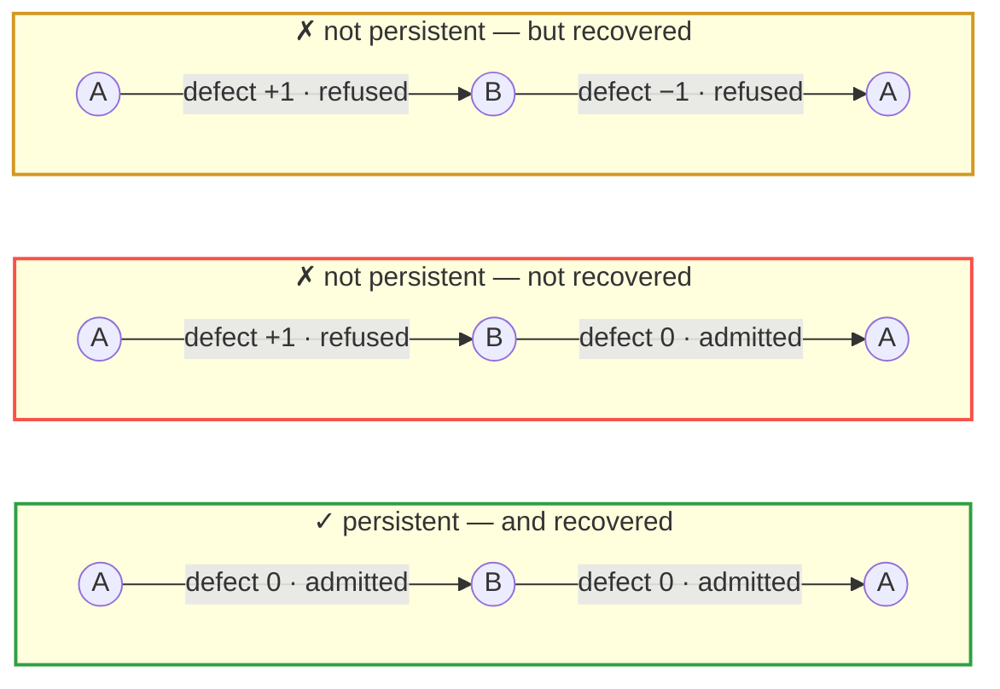

<div align="center">

# The Physics of Abstraction

### Identity at the Seam
**Phase Binding, Hidden Lineage, and Exact Persistence through Finite Drift**

[](https://doi.org/10.17605/OSF.IO/QJ5BR)
[](#the-audit-runs-itself)
[](#the-audit-runs-itself)

[](#the-audit-runs-itself)
[](#signed-deposit)
[](LICENSE)

**Maksim Barziankou** (MxBv)<br>
PETRONUS™ · The Urgrund Laboratory · <research@petronus.eu><br>
Poznań · July 2026

</div>

---

> ### *A state is what can be photographed.*
> ### *Identity is what must survive the cut.*

---

A line through time appears continuous only because its cuts are too fine to see. The image is
useful, but it is not yet mathematics. The mathematical question is:

> **What structure must be carried across each finite transition for one declared unit to persist
> exactly, even while its state, knowledge, burden, and physical performance change?**

This note answers it finite-first — and ships the executable model that checks its own claims.

## Three histories, one visible trace

Everything starts here. A system is observed at $A$, then $B$, then $A$ again. Three different
things could have happened in between. **The observation cannot tell them apart.**



All three display the trace $(A, B, A)$. The first persisted. The second did not. The third is the
trap: **its defects cancel**, so an inspector who looks only at the endpoint certifies it — while
identity was destroyed and restored in between.

That is the whole subject. Endpoint equality, similarity scores, and successful terminal repair all
fail to distinguish these, and no amount of finer sampling of the *same* observation fixes it. What
decides the verdict is not the states but the **law of transport** across each cut.

## What the note establishes

Temporal identity is typed on **histories**, not on endpoint states: a persistence predicate is a
wide subcategory of identity-admissible transitions — *seams*. From that typing follow results the
usual framing cannot state, let alone separate:

| | Result |
|---|---|
| **1** | **Uninterrupted persistence is not terminal recovery.** Every elementary seam admissible ⟹ the composite is admissible. The converse fails — defects cancel. |
| **2** | **Snapshot sufficiency has an exact criterion.** A snapshot-only verdict exists precisely when the identity predicate is constant on every observation fibre. On a mixed fibre the honest output is a third value — *insufficient observation* — not a confidence score. |
| **3** | **Phase binding measures hidden lineage, not persistence.** Conditional entropy under a sealed audit quantifies what the visible trace leaves unresolved. Positive binding blocks uniform exact reconstruction under confined access — and still does not mean identity was lost. |
| **4** | **A cocycle certifies only if its kernel is complete.** An instrument whose neutral class exceeds the admitted class is a false certificate; neutral accumulated holonomy certifies terminal recovery alone. |
| **5** | **Audit-only instrumentation suffices — constructively.** A persistence-complete membership record determines the exact verdict where snapshots cannot, while staying outside the acting agent's optimisation surface. |
| **6** | **Small tolerances accumulate.** Arbitrarily small local defects reach a finite global defect, with no completed infinity required. |
| **7** | **Learning and wear coexist with exact persistence** — by typing, and only under explicit anti-vacuity obligations. |
| **8** | **Admissibility cannot be learned from unlabelled transitions.** A grounding channel is necessary. |

## What is *not* claimed

*Physics of abstraction* names a **structural programme**, not an empirical result.

No physical law is announced · no formal witness is identified with phenomenal consciousness,
biological personhood, or moral identity · no UUID, database key, or preserved bit is sufficient for
identity · no actual infinity and no nilsquare infinitesimal is assumed by the finite theory · no
endpoint equality, similarity score, or successful terminal repair is treated as evidence of
uninterrupted identity.

The note states these boundaries in §0.3 and defends them in §15. They are load-bearing, not
throat-clearing.

## The audit runs itself

The note does not ask to be trusted on its finite model — it ships it. Standard library only, no
dependencies, no install:

```bash
python harness/seam_audit.py        # → finite seam audit passed: 29 checks
python -O harness/seam_audit.py     # same under -O: no check is a bare `assert`
python harness/check_bundle.py      # → bundle checks passed: 14 gates, 4 mutations
```

<table>
<tr><td width="50%" valign="top">

**What the audit does**

Exhaustively enumerates **all 182 typed histories** of length one to three over eight declared seam
schemas. Computes the declared conditional entropies from exact rational masses. Separates the
snapshot / audit-verdict / audit-lineage views. Checks generator-level kernel completeness against a
deliberately blind instrument. Emits a deterministic certificate.

</td><td width="50%" valign="top">

**Why you can trust the audit**

The bundle gate re-derives that certificate and compares it **byte for byte**. Then it applies four
scratch mutations to the audit source — each of which **must** be rejected by its own marker.

*An audit that cannot fail is not evidence.*

</td></tr>
</table>

| Path | Role |
|---|---|
| `The-Physics-of-Abstraction.md` | the note — canonical source |
| `The Physics of Abstraction — Identity at the Seam (2026).pdf` | typeset edition |
| `harness/seam_audit.py` | the finite model — 29 named checks + certificate emitter |
| `harness/seam_certificate.json` | the sealed deterministic certificate |
| `harness/check_bundle.py` | bundle gate — inventory, hygiene, execution, certificate, mutations |
| `harness/seam_transport.py` | compatibility entry point |
| `harness/README.md` | what each check covers |

## Signed deposit

This repository carries the readable, runnable version. The **signed** deposit — every artifact with
its detached GPG signature, a `SHA256SUMS` manifest, and an OpenTimestamps Bitcoin anchor over that
manifest — lives at the DOI:

<div align="center">

### [10.17605/OSF.IO/QJ5BR](https://doi.org/10.17605/OSF.IO/QJ5BR)

</div>

```bash
sha256sum -c SHA256SUMS                          # integrity
gpg --verify The-Physics-of-Abstraction.md.sig \
            The-Physics-of-Abstraction.md        # authenticity
ots verify SHA256SUMS.ots                        # existence in time
```

Signing key — PETRONUS Research, `9E803F8037EE98E5846CE38B0C7F9CBB6D54185D`.

## Corpus

A formal note in **Navigational Cybernetics 2.5**. It extends the temporal side of *Identity Does
Not Drift* and the reconstructive side of *Severance Defect and the Binding Functional*; neither
work is replaced or silently redefined.

| Companion | DOI |
|---|---|
| NC2.5 — Axiomatic Core v2.1 | [`10.17605/OSF.IO/NHTC5`](https://doi.org/10.17605/OSF.IO/NHTC5) |
| Severance Defect and the Binding Functional | [`10.17605/OSF.IO/5VJMR`](https://doi.org/10.17605/OSF.IO/5VJMR) |
| Cross-Temporal Coherence | [`10.17605/OSF.IO/UQ4AW`](https://doi.org/10.17605/OSF.IO/UQ4AW) |
| ONTOΣ XIV — Nested Substrates | [`10.17605/OSF.IO/KAGMH`](https://doi.org/10.17605/OSF.IO/KAGMH) |
| ONTOΣ XV — Spin-Channel and Nestability | [`10.17605/OSF.IO/EAUD5`](https://doi.org/10.17605/OSF.IO/EAUD5) |

## License

[CC BY-NC-ND 4.0](LICENSE) — share with attribution, no commercial use, no derivatives.
The harness is published under the same terms as the note it verifies.

<div align="center">

---

*The physics of abstraction begins at the cut.*

</div>
